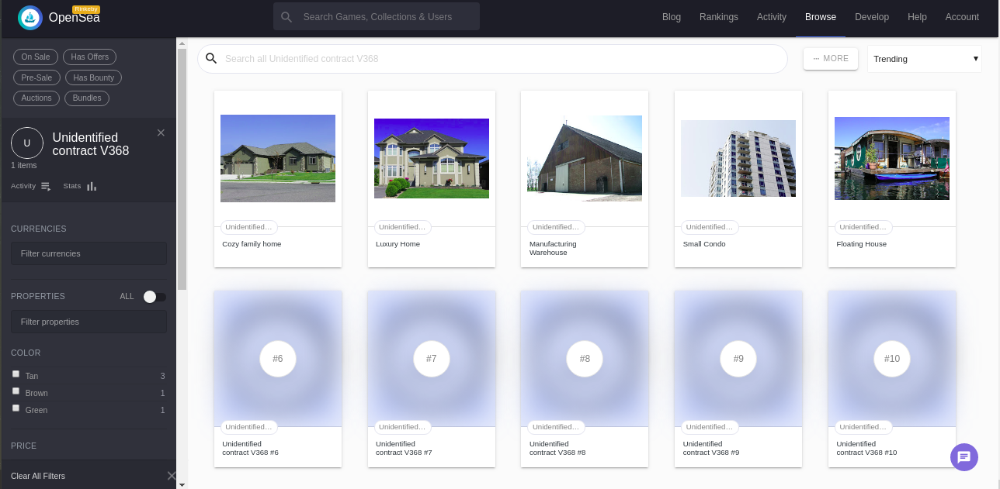

# Udacity Blockchain Capstone

The capstone will build upon the knowledge you have gained in the course in order to build a decentralized housing product. 

## Getting Started

### Prequisites
For development make sure ganache-cli is installed globally,metamask extension is enabled and solidity compiler is configured in truffle config.

### Install Dependencies
* Install all requisite npm packages
```
npm install
```


### ZoKrates Setup

 The following instructions explain how to generate addtional proofs for tokenIds.

* Step 1: Run Docker

* Step 2: Run ZoKrates
  ```
  docker run -v `pwd`/zokrates/code/:/home/zokrates/code -ti zokrates/zokrates /bin/bash
  ```

  Change into the square directory
  ``` 
  cd code/square/
  ``` 

* Step 3: Compile the program written in ZoKrates DSL
  ``` 
  ~/zokrates compile -i square.code
  ``` 

* Step 4: Generate the trusted setup
  ``` 
  ~/zokrates setup -s GM17
  ```

* Step 5: Compute witness
  ``` 
  ~/zokrates compute-witness -a 3 9
  ```

* Step 6: Generate proof
  ```
  ~/zokrates generate-proof -s GM17 -j <path to proof file>
  ```

* Step 7: Export verifier
  ``` 
  ~/zokrates export-verifier -s GM17
  ```
Re-run steps 5 and 6 with different arguments, e.g. 2 4, to generate additional proofs for minting tokens.

### Development environment
* Run ganache:
```
ganache-cli
```
* In another terminal window:
```
cd eth-contracts
```
* Compile the contracts:
```
truffle compile
```

* This will create the smart contract artifacts in folder ```build/contracts```.

* Migrate smart contracts to the locally running blockchain, ganache-cli:

```
truffle migrate
```

* Test the smart contracts:

```
truffle test
```

### Deploy on Rinkeby
Run
```
truffle migrate --network rinkeby --reset --compile-all
```


#### Output

```
Starting migrations...
======================
> Network name:    'rinkeby'
> Network id:      4
> Block gas limit: 10000000 (0x989680)


1_initial_migration.js
======================

   Replacing 'Migrations'
   ----------------------
   > transaction hash:    0x03dc27bb8bab952b04dc93b34e997a8ea98257dfbbcba6184fdc772876dd44d2
   > Blocks: 2            Seconds: 27
   > contract address:    0x0294C5bBdD1B888F2f054b038d1E4593cbBE4006
   > block number:        6490721
   > block timestamp:     1589516255
   > account:             0x243C5A0e6b5180aAF8DdE6185D698526C596bF87
   > balance:             2.628942181
   > gas used:            225237 (0x36fd5)
   > gas price:           10 gwei
   > value sent:          0 ETH
   > total cost:          0.00225237 ETH


   > Saving migration to chain.
   > Saving artifacts
   -------------------------------------
   > Total cost:          0.00225237 ETH


2_deploy_contracts.js
=====================

   Replacing 'RealStateToken'
   --------------------------
   > transaction hash:    0xbecb4450c4bd3571c1b87f8d20f5038e4a5ac17fec7ce7388190403a00d01dfc
   > Blocks: 1            Seconds: 10
   > contract address:    0xc98B41a5d7fF5C71965027D1AAa7FDF7Fb1B62AD
   > block number:        6490723
   > block timestamp:     1589516285
   > account:             0x243C5A0e6b5180aAF8DdE6185D698526C596bF87
   > balance:             2.600429461
   > gas used:            2808909 (0x2adc4d)
   > gas price:           10 gwei
   > value sent:          0 ETH
   > total cost:          0.02808909 ETH


   Replacing 'BN256G2'
   -------------------
   > transaction hash:    0x875d713f703bfbce59fee78f35143d234dc47cb58126ccf25d95368e75a1701e
   > Blocks: 1            Seconds: 18
   > contract address:    0x4Cd3693d1A942b11971A550B9f906EEE21174a8E
   > block number:        6490725
   > block timestamp:     1589516315
   > account:             0x243C5A0e6b5180aAF8DdE6185D698526C596bF87
   > balance:             2.590093721
   > gas used:            1033574 (0xfc566)
   > gas price:           10 gwei
   > value sent:          0 ETH
   > total cost:          0.01033574 ETH


   Linking
   -------
   * Contract: Verifier <--> Library: BN256G2 (at address: 0x4Cd3693d1A942b11971A550B9f906EEE21174a8E)

   Replacing 'Verifier'
   --------------------
   > transaction hash:    0x017a979ad5c1bb2a80481f3c40aa2ad74d5ff62d3778df29a9fe0c904024b6e6
   > Blocks: 1            Seconds: 18
   > contract address:    0xb5Fc18b0b3b40B5e01e6248318c17257b01d1DB8
   > block number:        6490727
   > block timestamp:     1589516345
   > account:             0x243C5A0e6b5180aAF8DdE6185D698526C596bF87
   > balance:             2.578076251
   > gas used:            1201747 (0x125653)
   > gas price:           10 gwei
   > value sent:          0 ETH
   > total cost:          0.01201747 ETH


   Replacing 'SolnSquareVerifier'
   ------------------------------
   > transaction hash:    0x1b8af585ab361ca00950b294b0f433e65293dedaaa7ed642470e6fa1afcfae5e
   > Blocks: 2            Seconds: 20
   > contract address:    0xFEb7ff8c0E57691d8F2e9755D080A579AEC7c953
   > block number:        6490729
   > block timestamp:     1589516375
   > account:             0x243C5A0e6b5180aAF8DdE6185D698526C596bF87
   > balance:             2.544549241
   > gas used:            3352701 (0x33287d)
   > gas price:           10 gwei
   > value sent:          0 ETH
   > total cost:          0.03352701 ETH


   > Saving migration to chain.
   > Saving artifacts
   -------------------------------------
   > Total cost:          0.08396931 ETH


Summary
=======
> Total deployments:   5
> Final cost:          0.08622168 ETH


```

### Mint Tokens
* Inside ```eth-contracts folder```, Run
```
node addSolution.js ../zokrates/code/square/proofs/proof<number>.json <tokenId>

node mintToken.js <tokenId>
```

## Output


[a relative link](tokenoutputlog.md)


### Contract Address and ABI
#### View the contracts on etherscan 

  * "Verifier": "0xb5Fc18b0b3b40B5e01e6248318c17257b01d1DB8",
  * "SolnSquareVerifier": "0xFEb7ff8c0E57691d8F2e9755D080A579AEC7c953"

#### Contract ABI

* Verifier
```
"abi": [
    {
      "anonymous": false,
      "inputs": [
        {
          "indexed": false,
          "internalType": "string",
          "name": "s",
          "type": "string"
        }
      ],
      "name": "Verified",
      "type": "event"
    },
    {
      "constant": false,
      "inputs": [
        {
          "internalType": "uint256[2]",
          "name": "a",
          "type": "uint256[2]"
        },
        {
          "internalType": "uint256[2][2]",
          "name": "b",
          "type": "uint256[2][2]"
        },
        {
          "internalType": "uint256[2]",
          "name": "c",
          "type": "uint256[2]"
        },
        {
          "internalType": "uint256[2]",
          "name": "input",
          "type": "uint256[2]"
        }
      ],
      "name": "verifyTx",
      "outputs": [
        {
          "internalType": "bool",
          "name": "r",
          "type": "bool"
        }
      ],
      "payable": false,
      "stateMutability": "nonpayable",
      "type": "function"
    }
  ],
```
* SolnSquareVerifier

[Link to SolnSquareVerifier Abi ](SolnSquareVerifierAbi.md)

* OpenSea Market Place Url - https://rinkeby.opensea.io/assets/unidentified-contract-v368




# Project Resources

* [Remix - Solidity IDE](https://remix.ethereum.org/)
* [Visual Studio Code](https://code.visualstudio.com/)
* [Truffle Framework](https://truffleframework.com/)
* [Ganache - One Click Blockchain](https://truffleframework.com/ganache)
* [Open Zeppelin ](https://openzeppelin.org/)
* [Interactive zero knowledge 3-colorability demonstration](http://web.mit.edu/~ezyang/Public/graph/svg.html)
* [Docker](https://docs.docker.com/install/)
* [ZoKrates](https://github.com/Zokrates/ZoKrates)
